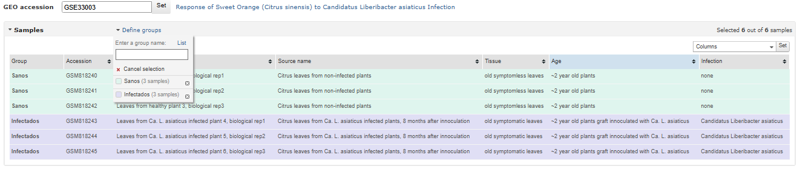
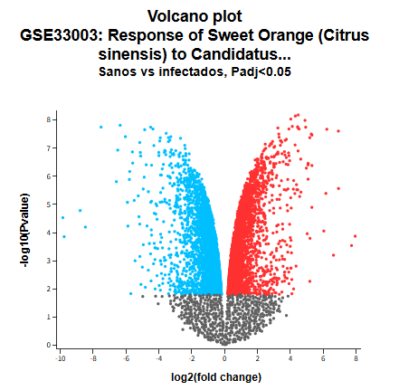
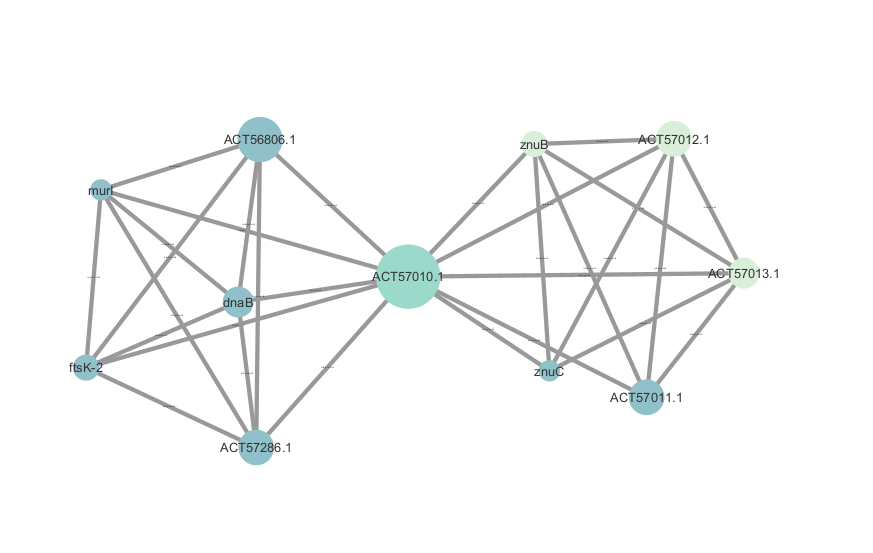

### Introducción


### Objetivo general

Uso de metadatos para el análisis del bacterioma de arboles de Citrus sinensis sanos vs. infectadas con HLB.

#### Objetivos particulares

-   Realizar un análisis de secuenciación del 16S para determinar abundancia de bacterias y analizar cómo se ve alterado el bacterioma tras una enfermedad.

-   Aplicar medidas de diversidad para identificar los géneros mas abundantes y discutir que implicaciones biológicas tiene.

# PARTE 1: Análisis de expresión diferencial de genes en GEO

Se utilizaron los datos del proyecto ["GSE33003"](https://www.ncbi.nlm.nih.gov/geo/query/acc.cgi?acc=GSE33003) para hacer un análisis de expresion diferencial de genes entre un grupo de plantas sanas y otras infectadas con *Candidatus liberibacter* Indentificar aquellos genes de los que sus niveles de expresion se ven alterdos por la presencia del patogeno.

1.  Se hace la designacion de grupos



2.  Realizar analisis



3.  Extraccón de la tabla de genes.

4 Conversión de los ID de GB_ACC a Ensembl_ID y GO_ID

```{r}

citrus <- read.csv("data_table/citrus.csv") # Cargar tabla de genes de GEO

# Determinar los genes sub/sobre-expresados
sobre<-citrus[which(citrus$adj.P.Val < .05 & citrus$logFC > 0), ] # Sobreexpresados
sube<-citrus[which(citrus$adj.P.Val < .05 & citrus$logFC < 0), ] # Subexpresados

# Ver si podemos sacar los nombre convencionales con biomaRT
library(biomaRt)

head(biomaRt::listMarts(host = "https://www.ensembl.org"), 10)# ver los marts/fuentes disponibles

## Usamos la especializada en genomas vegetales
head(biomaRt::listDatasets(useMart("plants_mart", host = "https://plants.ensembl.org")), )

## Atributos
head(listAttributes(biomaRt::useDataset(
  dataset = "cclementina_eg_gene",         
  mart    = useMart("plants_mart", host = "https://plants.ensembl.org"))), 10)        

## Filtros
head(listFilters(biomaRt::useDataset(
  dataset = "cclementina_eg_gene",         
  mart    = useMart("plants_mart", host = "https://plants.ensembl.org"))), 10) 

## Establecer la base con la vamos a trabajar
datos<-useDataset(
  dataset = "cclementina_eg_gene",         
  mart    = useMart("plants_mart", host = "https://plants.ensembl.org"))

## Generacion de un subconjunto de datos (tabla) para solo los genes sub y sobreexpresados
sobre2<-citrus[which(citrus$adj.P.Val < .05 & citrus$logFC > 0), 5] 
sube2<-citrus[which(citrus$adj.P.Val < .05 & citrus$logFC < 0), 5]

conjunto<-c(sobre2,sube2) #Concatenar ambas tablas
write.csv(conjunto,"resultados_fr/GB_ACC.csv") # Generar tabla

identificadores<-getBM(attributes = c("ensembl_gene_id", "go_id"), # Transformación de los ID a GO_ID    
      values     = conjunto,         
      mart       = datos)

head(identificadores) # Visualizar los primeros GO_ID encontrados
```

5.  Tabla de GO en DAVID a partir del GB_ACC

.jpeg) .jpeg) .jpeg)

```{r}
## Evaluar si los genes obtenidos con DAVID (GO) se sub o sobreexpresan
c(any("AJ012696"==sobre$GB_ACC), ## TRUE se sobreexpresa
  any("CX070042"==sobre$GB_ACC), ## TRUE
  any("AY243478"==sobre$GB_ACC), ## TRUE
  any("AY36204"==sobre$GB_ACC),  ## FALSE
  any("CB292663"==sobre$GB_ACC), ## FALSE
  any("AF255013"==sobre$GB_ACC), ## FALSE
  any("CB292529"==sobre$GB_ACC) ## TRUE
)
```

6.  Tabla con anotaciones de GO en R

```{r}
# Cargar librerias necesarias
library(BiocManager)
library(GEOquery)
library(DT)

anotaciones <- getGEO("GPL5731") 
anotaciones <- Table(anotaciones) 

DT::datatable(anotaciones) #Tabla de ID con anotaciones y GO

```

# Parte 2: Análisis de diversidad

## Paso 1: creación de archivos FASTQ

Uso de las herramietas SRAtoolkit en Ubuntu.

## Paso 2: creación de objetos Phyloseq

```{r}
#DADA2
library(Rcpp)
library (dada2)

##### Cargar biblioteca y datos
path_sano <- "archivos_fastq"
list.files(path_sano)

##### Extraer los nombres de las muestras
# Forward and reverse fastq tienen el formato: SAMPLENAME_1.fastq y SAMPLENAME_1.fastq
s1F_sano <- sort(list.files(path_sano, pattern="SRR17677269_1.fastq", full.names = TRUE))
s1R_sano <- sort(list.files(path_sano, pattern="SRR17677269_2.fastq", full.names = TRUE))
# Extraer nombres de las muestras, assuming filenames have format: SAMPLENAME_XXX.fastq
sample.names <- sapply(strsplit(basename (s1F_sano), "_"), `[`, 1)
sample.names

#Para que corra: readRDS("dada2/seqtab.RDS")


## Verifcar calidad PHRED
length(s1F_sano)
length(s1R_sano)

##Forward
pdf("resultados_fr/Q_Forward_sano.pdf", width=13, height = 8)
plotQualityProfile(s1F_sano[1])
dev.off()

##Reverse
pdf("resultados_fr/Q_Reverse_sano.pdf", width=13, height = 8)
plotQualityProfile(s1R_sano[1])
dev.off()


##### Filtrar y Cortar
# Colocar las SRR filtradas en un subdirectorio 
# Cree el forder manualmente para que no se lleve más tiempo 

s1_filtF_sano<- file.path(path_sano, "filtered", paste0(sample.names, "_s1F_filt_sano.fastq.gz"))
s1_filtR_sano<- file.path(path_sano, "filtered", paste0(sample.names, "_s1R_filt_sano.fastq.gz"))
names(s1_filtF_sano) <- sample.names
names(s1_filtR_sano) <- sample.names

##### Filtrar por calidad 
s1_out_sano<- filterAndTrim(s1F_sano, s1_filtF_sano, s1R_sano, s1_filtR_sano, truncLen = c(120,120),
                        maxN=0, maxEE=c(2,2), truncQ=2, rm.phix=TRUE,
                        compress=TRUE, multithread= TRUE) # Este ultimo FALSE porque está en windows


##### Aprender de los errores 
s1_errF_sano<- learnErrors(s1_filtF_sano, multithread=TRUE)
s1_errR_sano<- learnErrors(s1_filtR_sano, multithread=TRUE)

#Gráficas de tasas de error
png("resultados_fr/Errores_Forward_sano.png")
plotErrors(s1_errF_sano, nominalQ=TRUE)
dev.off()

png("resultados_fr/Errores_Reverse_sano.png")
plotErrors(s1_errR_sano, nominalQ=TRUE)
dev.off()

##inferencia
s1_dadaF_sano <- dada(s1_filtF_sano, err=s1_errF_sano, multithread=TRUE)
s1_dadaR_sano<- dada(s1_filtR_sano, err=s1_errR_sano, multithread=TRUE)


##### Mezclar, hacer de las 2 direcciones
#| echo: true
s1_mergers_sano <- mergePairs(s1_dadaF_sano, s1_filtF_sano, s1_dadaR_sano, s1_filtR_sano, verbose=TRUE)
saveRDS(s1_mergers_sano, file="resultados_fr/s1_mergers_sano.RDS")

s1_mergers_sano
s1_seqtab_sano <- makeSequenceTable (s1_mergers_sano)
rownames(s1_seqtab_sano) <- sample.names##asingnar nombre a las filas sino no corre después
dim (s1_seqtab_sano)
saveRDS(s1_seqtab_sano, file="resultados_fr/seqtab_sano.RDS")


s1_seqtab_nochim_sano <- removeBimeraDenovo(s1_seqtab_sano, method="consensus", multithread=TRUE, verbose=TRUE) ##### Remover quimeras

rownames(s1_seqtab_nochim_sano)###revisando el error de las filas

sum (s1_seqtab_nochim_sano)/sum(s1_seqtab_sano)

#Save RDS --> se refiere a los objetos que ya están en la carpeta resultados

s1_getN_sano <- function(x) sum(getUniques(x)) ##### Quitar el ruido 
s1_track_sano <- cbind(s1_out_sano,
                  s1_getN_sano(s1_dadaF_sano),
                  s1_getN_sano(s1_dadaR_sano),
                  s1_getN_sano(s1_mergers_sano),
                  rowSums(s1_seqtab_nochim_sano))
colnames(s1_track_sano) <- c("input", "filtered", "denoisedF", "denoisedR", "merged", "nonchim")
rownames(s1_track_sano) <- sample.names
head(s1_track_sano)

#### Asignación taxonómica


# Género 
s1_taxa_sano<- assignTaxonomy(s1_seqtab_nochim_sano, "resultados_fr/silva_nr99_v138.2_toGenus_trainset.fa.gz", multithread=TRUE)
saveRDS (s1_taxa_sano, file="resultados_fr/taxa_sano.RDS")
readRDS (file="resultados_fr/taxa_sano.RDS")

s1_taxa_sano<- assignTaxonomy(s1_taxa_sano, "resultados_fr/silva_nr99_v138.2_toSpecies_trainset.fa.gz")
saveRDS (s1_taxa_sano, file="resultados_fr/taxa_sano.RDS")
readRDS ("resultados_fr/taxa_sano.RDS")

# Especies
s1_taxa_sano<- addSpecies(s1_taxa_sano, "resultados_fr/silva_v138.2_assignSpecies.fa.gz")
saveRDS (s1_taxa_sano, file="resultados_fr/taxa_sano.RDS")
readRDS ("resultados_fr/taxa_sano.RDS")


##### Objeto más simple es una tabla
s1_taxa_sano_print <- s1_taxa_sano
rownames(s1_taxa_sano_print) <- NULL
head(s1_taxa_sano_print)


#### Data frame con metadatos 
library(phyloseq)
library(Biostrings)
library(ggplot2)

#Hay que editarlo, pero aún no se las características con la que está organizado el objeto
theme_set(theme_bw())
s1_samples_out_sano <- rownames(s1_seqtab_nochim_sano)
class(s1_samples_out_sano)
sujeto_sano<- sapply(strsplit(s1_samples_out_sano, "D"), `[`, 1)#tenía subect como nombre pero eso confunde a R

gender <- substr(sujeto_sano,1,1)
sujeto_sano <- substr(sujeto_sano,2,999)
day <- as.integer(sapply(strsplit(s1_samples_out_sano, "D"), `[`, 2))
s1_df_sano <- data.frame(Subject=sujeto_sano, Gender=gender, Day=day)
s1_df_sano$When <- "Early"
s1_df_sano$When[s1_df_sano$Day>100] <- "Late"
rownames(s1_df_sano) <- s1_samples_out_sano


#### Phyloseq
ps1_sano <- phyloseq(otu_table(s1_seqtab_nochim_sano, taxa_are_rows=FALSE), 
                sample_data(s1_df_sano), 
                tax_table(s1_taxa_sano))
ps1_sano<- prune_samples(sample_names(ps1_sano) != "Mock", ps1_sano) # Remove mock sample
dna1_sano <- Biostrings::DNAStringSet(taxa_names(ps1_sano))

names(dna1_sano) <- taxa_names(ps1_sano)
ps1_sano <- merge_phyloseq(ps1_sano, dna1_sano)

taxa_names(ps1_sano) <- paste0("ASV", seq(ntaxa(ps1_sano)))
ps1_sano

save(ps1_sano,file="resultados_fr/ps_sano.RDS")

```

## Paso 3: estimacion de los indices de diversidad alfa

```{r}
#####ANÁLISIS

otu<-otu_table(ps1_sano)###OTU table

tax_table(ps1_sano)###TAX table

sample_data(ps1_sano)

plot_richness(otu,measures = c("Chao1", "Simpson", "Shannon"))##tenemos una sola muestra

```

# Parte 3: Generación de la red de IPP en *Candidatus liberibacter*

## Red en Cytoscape

A partir de la red de IPP de la [*Candidatus liberibacter*](https://string-db.org/network/537021.CLIBASIA_02120) se obtuvieron los datos para cargar la realizar la red en cytoscape y modificarla, tanto en la aplicacion como en R, para obtener algunas propiedades de la red y diversas medidas de centralidad.



## Red en R

```{r}
# Cargar librerias necesarias
library(RCy3)
library(igraph)

cytoscapePing() # Conectar con cytoscape
proteinas <- createIgraphFromNetwork("IPP.tsv") # Cargar red de cytoscape a igraph
plot(proteinas) # Ver red 
```

## Propiedades de la red

```{r}
### Caracteristicas de la red
edges <- gsize(proteinas) # Número de conexiones 
nodos <- gorder(proteinas) # Número de nodos
hubs <- sort(degree(proteinas, mode = "total"), decreasing = TRUE)[1:3] # Hubs seg. degree.
transitividad <- transitivity(proteinas, type = "local") # Transitividad
diametro <- diameter(proteinas) # Diametro

adjency <- as_adjacency_matrix(proteinas) # Matriz de adj
distancias <- distances(proteinas) # Matriz de dist

### ANALISIS DE LA RED
dd <- degree_distribution(proteinas) # Distribucion del degree
barplot(dd, main='Distribucion del degree', ylim = c(0:1), col='brown', ylab = "Pk", xlab = "K")
```

# Hubs - Proteinas principales: que interaccionan más con otras proteinas

```{r}
hubs
```

```{r}
grupos <- cluster_label_prop(proteinas) # Detectar y visualizar grupos 
degree <- degree(proteinas, mode = "total") # Degree total por nodos 
plot(grupos, proteinas,vertex.label.cex=degree/10, vertex.size=degree*5) 
```

## Medidas de centralidad

```{r}
hist(degree(proteinas, mode = "total"), breaks=10, col="violet", main="Degree") # Degree
```

```{r}
hist(betweenness(proteinas), breaks=10, col="skyblue", main="Betweenness") # Betweenness
```

```{r}
hist(closeness(proteinas, mode = "total"), breaks=10, col="pink", main="Closeness") # Closeness
```

# Referencias

-   Duan, Y., Zhou, L., Hall, D. G., Li, W., Doddapaneni, H., Lin, H., Liu, L., Vahling, C. M., Gabriel, D. W., Williams, K. P., Dickerman, A., Sun, Y., & Gottwald, T. (2009). Complete genome sequence of citrus huanglongbing bacterium, «Candidatus Liberibacter asiaticus» obtained through metagenomics. Molecular Plant-Microbe Interactions: MPMI, 22(8), 1011-1020. <https://doi.org/10.1094/MPMI-22-8-1011>

-   Kim, J.-S., Sagaram, U. S., Burns, J. K., Li, J.-L., & Wang, N. (2009). Response of sweet orange (Citrus sinensis) to «Candidatus Liberibacter asiaticus» infection: Microscopy and microarray analyses. Phytopathology, 99(1), 50-57. <https://doi.org/10.1094/PHYTO-99-1-0050>

-   Zhou, Z., Duan, Y., Li, Y., Zhang, P., Li, Q., Yu, L., Han, C., Huo, J., Chen, W., & Xiao, Y. (2025). CYP98A monooxygenases: A key enzyme family in plant phenolic compound biosynthesis. Horticulture Research, 12(6), uhaf074. <https://doi.org/10.1093/hr/uhaf074>

-   Martinelli, F., Uratsu, S. L., Albrecht, U., Reagan, R. L., Phu, M. L., Britton, M., Buffalo, V., Fass, J., Leicht, E., Zhao, W., Lin, D., D’Souza, R., Davis, C. E., Bowman, K. D., & Dandekar, A. M. (2012). Transcriptome Profiling of Citrus Fruit Response to Huanglongbing Disease. PLOS ONE, 7(5), e38039. <https://doi.org/10.1371/journal.pone.0038039>
